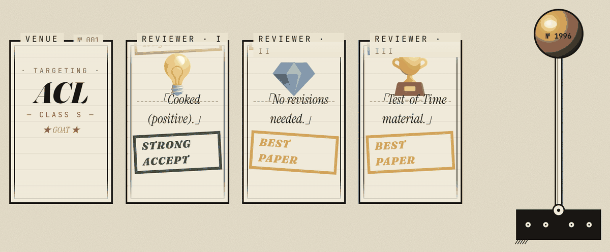

# 🕹️ Research Slot · 科研老虎机

<p align="center">
  
</p>

<p align="center">
  A peer-review lottery apparatus rendered as a 1970s academic broadside.<br>
  Pull the brass lever — three anonymous reviewers decide your paper's fate.
</p>

<p align="center">
  <a href="https://feed-scription.github.io/research-slot/" target="_blank"><strong>🎰 Try it online</strong></a>
</p>

<p align="center">
  
  
  
</p>

> A satire game for anyone who has ever submitted to NeurIPS, ICLR, ACL, CVPR …

---

## 🎰 How It Works

1. **Reel 1 — Venue**
   Spins a venue from the CCF 2026 directory plus community tiers: **god / top / mid / meme**.

2. **Reels 2–4 — Reviewers**
   Three independent reviewers roll in, each with a matched **emoji + comment + rating**.
   - ~12% of reviewers never show up (`REVIEW MISSING`).
   - Submitted scores are averaged to get a "natural" verdict.

3. **Meta-Reviewer Verdict**
   The final decision collapses to three outcomes: **Best Paper / Accept / Reject**.
   But watch out — the meta-reviewer has a ~15% chance to override the panel, in either direction.

4. **★ Wish Mode**
   Whisper a wish to the apparatus for a 95% accept rate and top-tier venues only.

---

## 🛠 Tech Stack

- **React 19** + **Vite 6** + **TypeScript**
- **Zustand** (persisted game state)
- **Framer Motion** (physics-based reel scrolling)
- **Tailwind CSS** (riso-print palette: paper / oxblood / forest / mustard / navy)
- **i18next** (zh-CN / en)
- **Web Audio API** + real samples (lever / reel-spin / accept / cheer)

---

## 💻 Development

```bash
npm install
npm run dev
```

Build for production:

```bash
npm run build
```

---

## 🤝 Contributing

Adding your own field takes **one JSON file** — see [`CONTRIBUTING.md`](CONTRIBUTING.md) for the step-by-step.

Reviewer comments live in `src/i18n/locales/{zh-CN,en}.json` under `commentsByRating`. Keep both locales in sync and bump `COMMENT_COUNTS` in `src/data/comments.ts` when adding entries.

---

## 📜 License

Apache 2, with apologies to Reviewer 2.
